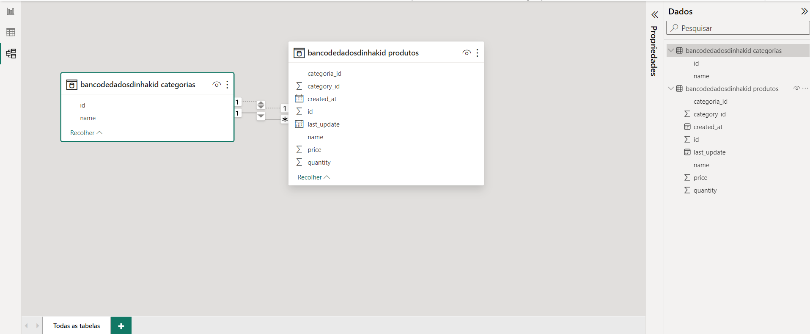
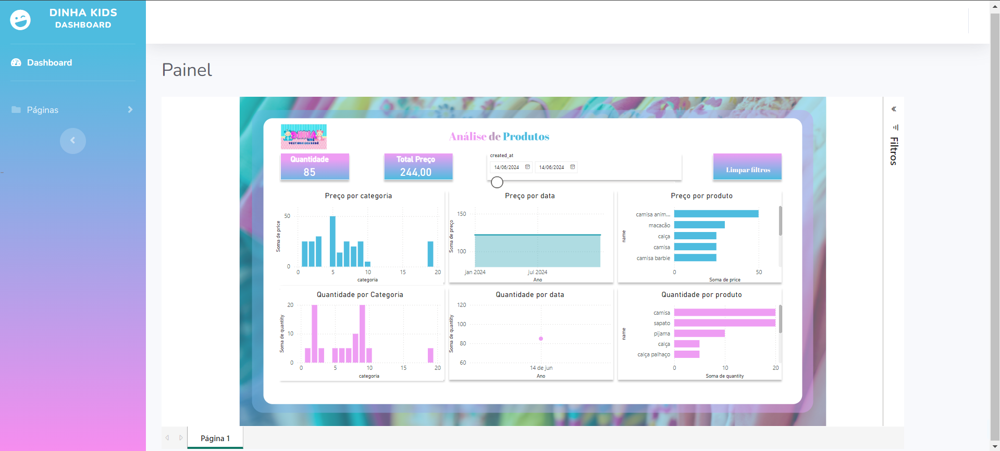
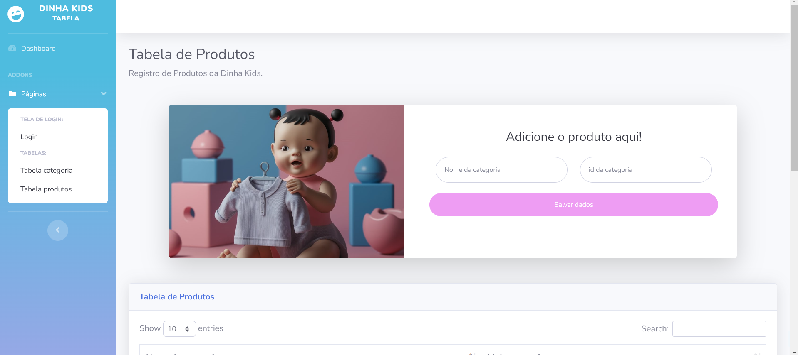
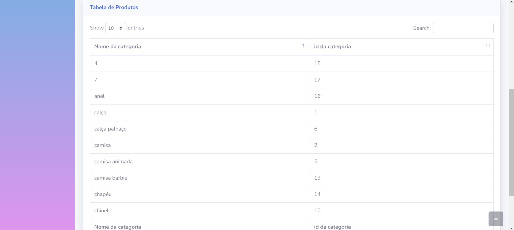
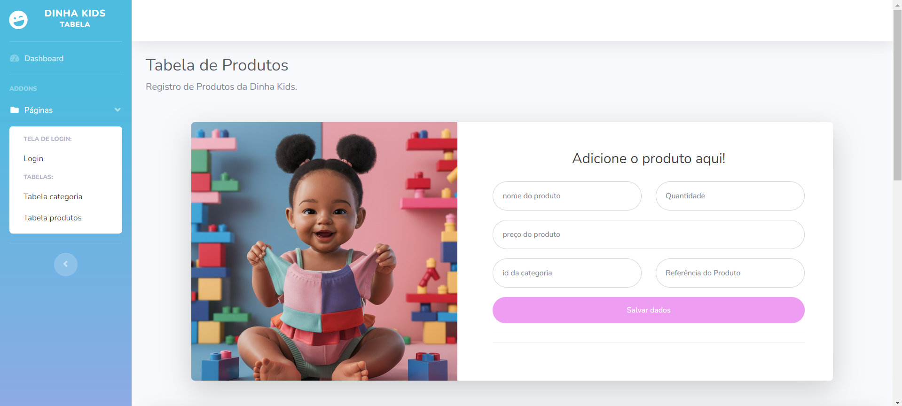
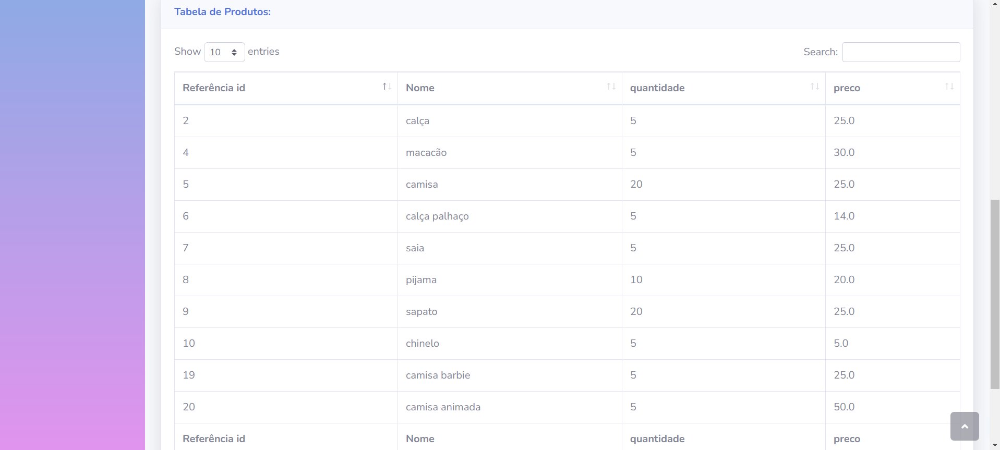

# Site Full stack Java: Dinha Kids

 
 <td> </td>
  

##  Introdução

Este projeto envolve o desenvolvimento de um site full stack, utilizando Java para o Back-End e HTML, CSS, e JavaScript para o Front-End. O projeto foi realizado como parte da disciplina de Programação Orientada a Objetos em Java na faculdade. Com o objetivo de aplicar nossos conhecimentos em um cenário real, estabelecemos uma parceria com a Dinha Kids, uma empresa de confecção de roupas infantis, que necessitava de um sistema para armazenar e gerenciar seus produtos. Durante o projeto, houve um contato direto e contínuo com o cliente para levantamento de requisitos e feedback constante. A Dinha Kids precisava de um sistema eficiente para controle e gestão de estoques e clientes. Após uma visita à fábrica e conversas com os funcionários, identificamos as seguintes necessidades:

* Registro de matérias-primas com uma interface intuitiva para consulta rápida do estoque disponível.
* Análise e armazenamento eficiente de dados, visando melhorar a gestão de pedidos.

O trabalho desenvolvido visa auxiliar no controle e gestão dos produtos e clientes, melhorando a manipulação de dados cruciais para o negócio. Este esforço resultará na criação de um software que a empresa poderá usar como uma ferramenta diária em suas operações.

##  Objetivo

* **Desenvolver e adquirir conhecimento sobre a linguagem de programação Java**: Aplicar os conceitos aprendidos em sala de aula em um projeto prático, aumentando nosso conhecimento e experiência.
* **Concluir o sistema para o cliente dentro do prazo determinado**: Demonstrar nossa capacidade e compromisso com a empresa.
* **Garantir uma operação mais eficiente e satisfatória**: Proporcionar uma ferramenta que melhore a eficiência operacional da Dinha Kids e a satisfação de seus clientes.

## Tecnologias Utilizadas

  
  

  

 

 
  
 
  

## Requisitos Essenciais e Critérios de Avaliação

| Requisito Essencial                  | Descrição                                                                 | Critério de Avaliação                                 | Método de Avaliação                                    |
|--------------------------------------|---------------------------------------------------------------------------|-------------------------------------------------------|-------------------------------------------------------|
| Banco de Dados                       | Criar um banco de dados para armazenar os dados inseridos no sistema, evitando perda de dados e facilitando a busca. | Funcionalidade de armazenamento e recuperação de dados sem erros. | Testes de inserção e recuperação de dados.            |
| Interface Interativa                 | Desenvolver uma interface de fácil uso e com um ótimo estilo para melhorar a experiência do usuário. | Usabilidade e estética da interface, feedback positivo dos usuários. | Testes de usabilidade, revisões de design, feedback dos usuários. |
| Dashboard de Análise                 | Criar um dashboard para análise dos dados inseridos no banco de dados, permitindo a tomada de decisões informadas. | Precisão e utilidade das análises geradas pelo dashboard. | Testes de funcionalidade, validação com dados reais, feedback do cliente. |
| Registro de Estoque de Confecções    | Implementar um sistema para registrar o estoque de peças de roupa.       | Precisão e atualização em tempo real do estoque.       | Testes de inserção, atualização e verificação de estoque. |
| Consulta Rápida de Estoque Disponível| Permitir consultas rápidas do estoque disponível.                         | Tempo de resposta e precisão das consultas de estoque. | Testes de velocidade e precisão de consultas de estoque. |
| Atualização da Situação de Estoque   | Possibilitar a atualização fácil e rápida da situação do estoque.        | Facilidade e rapidez na atualização de estoque.        | Testes de atualização de estoque, feedback dos usuários. |
| Interface Amigável e Intuitiva       | Criar uma interface que seja fácil de usar e intuitiva.                  | Nível de satisfação dos usuários com a interface.      | Testes de usabilidade, entrevistas com usuários, feedback contínuo. |
| Design Representativo da Empresa     | Desenvolver um design de interface que represente a identidade visual da empresa. | Coerência do design com a marca da empresa.            | Revisões de design, feedback dos stakeholders.         |
| Análise dos Dados Inseridos          | Implementar funcionalidades para analisar os dados inseridos nos formulários. | Precisão e utilidade das análises dos dados.           | Validação com dados reais, feedback do cliente.        |
| Armazenamento Seguro e Eficiente     | Garantir que o armazenamento dos dados seja seguro e eficiente.          | Segurança e eficiência do banco de dados.              | Auditorias de segurança, testes de desempenho do banco de dados. |
| Busca Eficiente de Dados             | Implementar uma busca eficiente para os dados inseridos.                 | Tempo de resposta e precisão das buscas.               | Testes de velocidade e precisão das buscas.            |
| Fácil Organização de Produtos        | Permitir a organização fácil e eficiente dos produtos inseridos no sistema. | Facilidade de organização e acesso aos produtos.       | Testes de organização, feedback dos usuários.          |

## Etapas do Desenvolvimento:

- **Back-End**:
  - Linguagem: Java
  - Framework: Spring Boot
  - Servidor: Tomcat
  - Conexão: Thymeleaf para conectar o back-end com o front-end
  - Controladores: Criados para gerenciar pedidos de produtos e conectar com o front-end
  - Modelos: Construção de modelos e criação de tabelas

- **Front-End**:
  - Linguagens: HTML, CSS, JavaScript
  - Modelo: Adaptado de um projeto web encontrado online
  - Estrutura: Alterações na estrutura do modelo, removendo páginas HTML desnecessárias e adaptando o design e CSS para representar a marca Dinha Kids

- **Banco de Dados**:
  - Tipo: MySQL
  - Conexão: Integrado com a aplicação Java para armazenar dados inseridos no formulário

- **Análise de Dados**:
  - Ferramenta: Power BI
  - Conexão: Ligado ao banco de dados MySQL da Dinha Kids
  - Função: Permitir a análise de dados para tomada de decisão informada
 
## Capturas de interface:

<table>
 <tr>
      <td><b> Banco de dados </b></td>
      <td><b> dashboard.html </b></td>
    </tr>
  <tr>
    <td></td>
    <td></td>
  </tr>
</table>

<table>
 <tr>
      <td><b> categoria.html </b></td>
      <td><b> categoria.html </b></td>
    </tr>
  <tr>
    <td></td>
    <td></td>
  </tr>
</table>

<table>
 <tr>
      <td><b> tables.html </b></td>
      <td><b> tables.html </b></td>
    </tr>
  <tr>
    <td></td>
    <td></td>
  </tr>
</table>

**Descrição**:

* **dashboard.html**: Página responsável por trazer a análise de dados em um dashboard feito no power BI.
* **categoria.html**: Página responsável pela inserção da Categoria dos produtos no banco de dados MySQL.
* **tables.html**: Página responsável pela inserção dos produtos no banco de dados com conexão com a tabela de categoria dos produtos da página categoria.html.

 
## Equipe do Projeto

1. [Matheus José](https://github.com/th3us117) -> Administração de Projeto : 
  * **Responsabilidades**: Documentação, levantamento de requisitos, e contato direto com a empresa.
2. [Júlio Rodrigo](https://github.com/JRodrigo19) -> Desenvolvedor Back-End :  
  * **Responsabilidades**: Implementação e manutenção do back-end, desenvolvimento de APIs, e integração com o banco de dados.
3. [José Vinícius](https://github.com/vtenorio309)  -> Analista de Banco de Dados :
  * **Responsabilidades**: Modelagem de banco de dados, otimização de consultas, e gerenciamento do banco de dados MySQL.
4. [Micael José](https://github.com/micaellimaj) -> Desenvolvedor Back-End :
  * **Responsabilidades**: Desenvolvimento de funcionalidades do servidor, implementação de lógica de negócios, e suporte na integração com o front-end.
5. [Jacciano do Nascimento](https://github.com/jacciano) -> Função: Desenvolvedor Front-End :
  * **Responsabilidades**: Criação e manutenção da interface do usuário, implementação de design responsivo, e adaptação do template web para as necessidades do projeto.

## Estrutura do repositório

------------

    │
    ├── LICENSE                    <- Licença do projeto
    │
    ├── README.md                  <- O Readme de nível superior para desenvolvedores que usam esse projeto
    │ 
    ├── Documentação               <- Contém a documentação do projeto
    │   
    ├── .idea                      <- Configurações do IntelliJ IDEA
    │ 
    ├── IMG                        <- Imagens da interface
    │ 
    ├── Sistemaweb                 <- Diretório principal do projeto Spring Boot
    │   ├── pom.xml                <- Arquivo de configuração do Maven, que gerencia as dependências do projeto
    │   ├── .mvn/wrapper           <- Arquivos do Maven Wrapper
    │   ├── .metadata              <- Metadados do projeto
    │   ├── .idea                  <- Configurações do projeto para IntelliJ IDEA
    │   ├── src                    <- Diretório principal do código-fonte
    │        ├── main              <- Diretório para os arquivos principais do código
    │         ├── java/com/example/dinhakids/sistemaweb
    │                ├── Controllers       <- Controladores responsáveis por receber as requisições HTTP e devolver as respostas apropriadas
    │                ├── DTO               <- Objetos de Transferência de Dados (Data Transfer Objects) usados para transportar dados entre camadas
    │                ├── Models            <- Modelos que representam as entidades do sistema
    │                ├── Repository        <- Repositórios responsáveis pela interação com o banco de dados
    │                ├── Services          <- Serviços que contêm a lógica de negócios do sistema
    │                ├── exceptions        <- Classes para tratamento de exceções
    │                ├── SistemaWebApplication.java  <- Classe principal que inicia a aplicação Spring Boot
    │         ├── resources
    │              ├── static              <- Arquivos estáticos como CSS, imagens e JavaScript
    │                 ├── css              <- Arquivos CSS
    │                 ├── iconetitulo      <- Ícones e favicons do site
    │                 ├── img              <- Imagens utilizadas na interface
    │                 ├── js               <- Arquivos JavaScript
    │                 ├── vendor           <- Dependências de terceiros (bibliotecas)
    │                 ├── páginas.html     <- Arquivos HTML estáticos
    │               ├── templates
    │                 ├── páginas.html     <- Templates Thymeleaf para renderização dinâmica
    │               ├── application.properties <- Arquivo de configuração do Spring Boot
    │
    └──

## Conclusão da Equipe

O desenvolvimento do sistema de gerenciamento de produtos para a Dinha Kids foi uma experiência enriquecedora e altamente educacional para toda a equipe. Ao longo do projeto, fomos capazes de aplicar teorias e conceitos aprendidos em sala de aula em um ambiente prático e colaborativo, o que nos permitiu compreender melhor os desafios e as demandas reais do mercado de trabalho.

Estamos confiantes de que as habilidades e conhecimentos adquiridos ao longo deste projeto serão altamente benéficos em nossas futuras carreiras. Esperamos continuar a aplicar e expandir esses conhecimentos em novos projetos, contribuindo positivamente para a evolução da indústria de tecnologia.

Agradecemos à Dinha Kids pela oportunidade de colaborar em um projeto tão significativo e ao professor Wolney pelo apoio contínuo e orientação valiosa durante todo o processo. Estamos animados para enfrentar novos desafios e continuar a crescer como desenvolvedores e profissionais.

    
