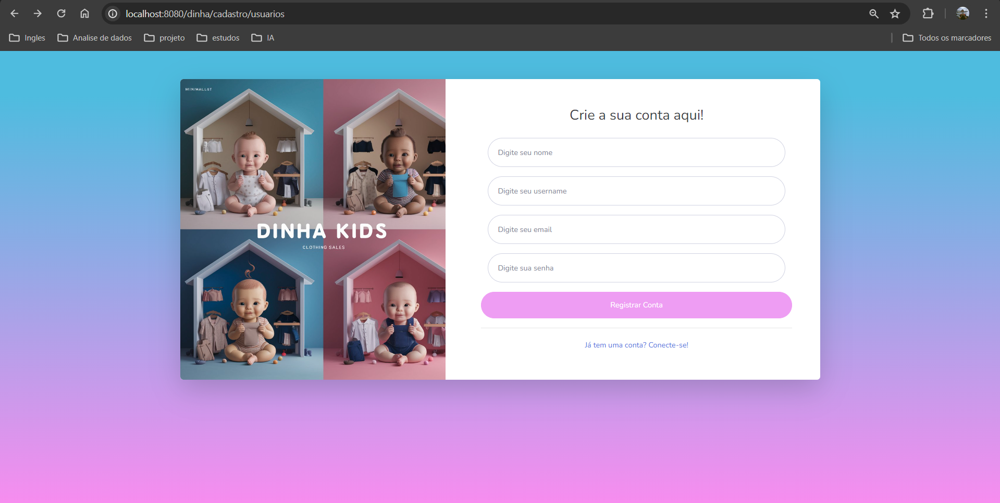
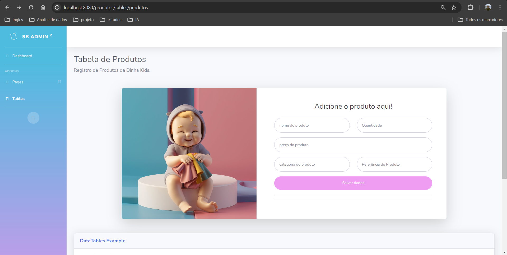

# Projeto: Site Full stack Java para Dinha Kids 👼

  <b>"DINHA KIDS -VESTINDO SEU BEBÊ"</b>  
 <td> </td>
  

## Sobre a Dinha Kids:
* Negócio de confecção de roupas infantis que tem como necessidade um sistema que organizasse de forma eficaz o estoque de roupas, que está sendo um problema enfrentado por eles;

## Objetivos do Sistema:
* Criar um banco de dados para armazenar os dados que serão inseridos no sistema, assim evita-se a perda de dados e a dificuldade de encontrá-los;
* Criar uma interface interativa, de fácil uso e com ótimo estilo, para proporcionar uma melhor experiência para o usuário;
* Criar um dashboard de análise de dados que vão sendo inseridos no banco de dados, assim proporcionando a tomada de decisões informadas;
* Criar sistema de autenticação de usuários por meio de página de login.

## Tecnologias utilizadas:

  
  

## Desenvolvimento:

* Desenvolvimento de website para a Dinha Kids que está no ramo da confecção de peças de roupas infantil e precisa de um sistema para armazenar, gerenciar e analisar dados.
* Utilização do HTML,  CSS  e JavaScript para o front-end, com adaptação de um template para o conteúdo necessário para a página e mudança do design para representar a marca.
* Uso do java para criação do back-end , com o uso do modelo spring boot  para mapeamento entre front e back, com alteração do html normal para thymeleaf e conexão com MySQL.
Construção de um power bi com conexão MySQL para análise das peças de roupas.

<table>
  <tr>
    <td></td>
    <td></td>
  </tr>
</table>

## Localização Dinha Kids:

* Caruaru, PE - "Capital do Forró"
